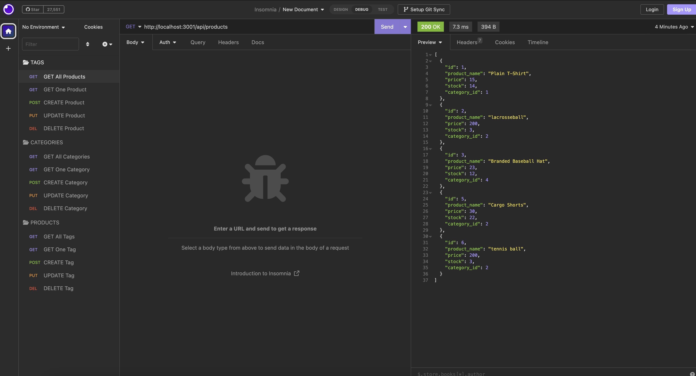
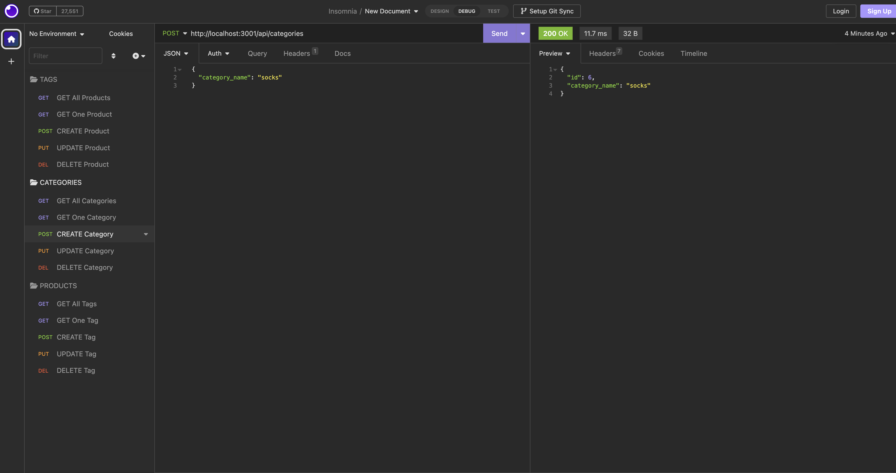
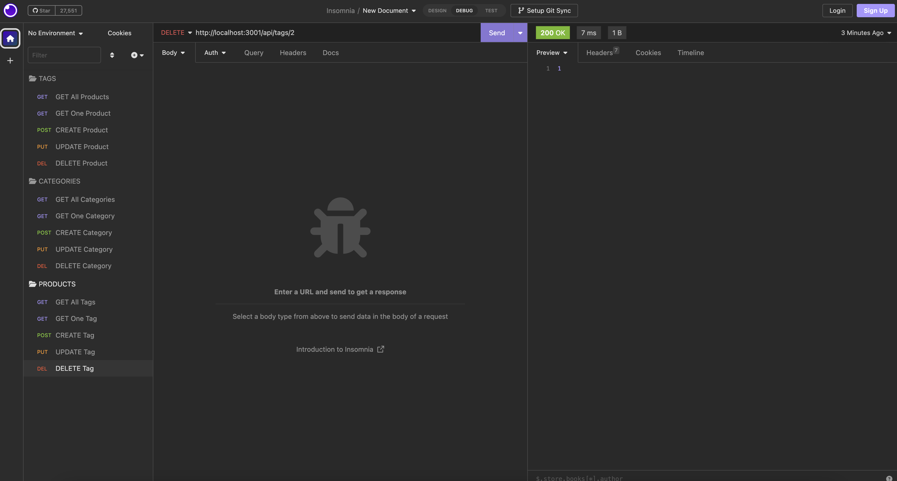

# ORM E-Commerce Back End

## User Story

```md
AS A manager at an internet retail company
I WANT a back end for my e-commerce website that uses the latest technologies
SO THAT my company can compete with other e-commerce companies
```

## Acceptance Criteria

```md
GIVEN a functional Express.js API
WHEN I add my database name, MySQL username, and MySQL password to an environment variable file
THEN I am able to connect to a database using Sequelize
WHEN I enter schema and seed commands
THEN a development database is created and is seeded with test data
WHEN I enter the command to invoke the application
THEN my server is started and the Sequelize models are synced to the MySQL database
WHEN I open API GET routes in Insomnia for categories, products, or tags
THEN the data for each of these routes is displayed in a formatted JSON
WHEN I test API POST, PUT, and DELETE routes in Insomnia
THEN I am able to successfully create, update, and delete data in my database
```

## Video Demonstration and GitHub Link

GitHub Link: https://github.com/chelseyvalerio/eCommerce-site-back-end
Video Demonstration: https://drive.google.com/file/d/1BXM64rXDoqLTcSAhr-miqA0F6zsyfVCh/view

## Mock-Up

In Insomnia, the user tests “GET products":



In Insomnia, the user tests "POST categories"



In Insomnia, the user tests "PUT products"


In Insomnia, the user tests "DELETE products"



## Functionality Installment Requirements

Sequalize
Express

## To Start App

1. log into sql and source schema
2. npm i
3. npm run seed
4. npm start

## Contact

Please contact me at cvalerio@csog.net with any questions
